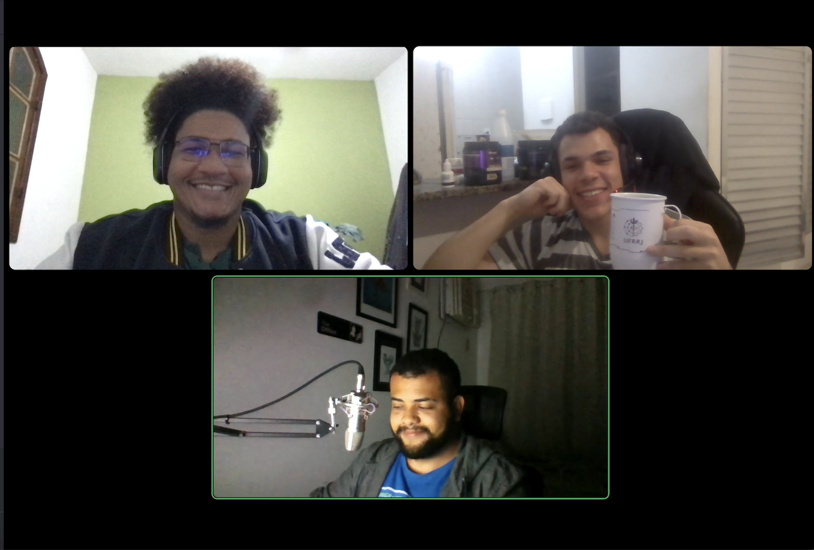
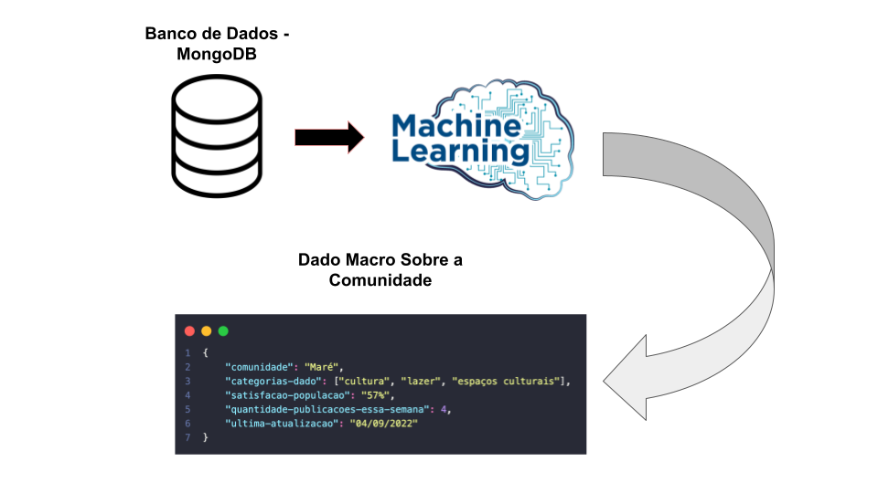
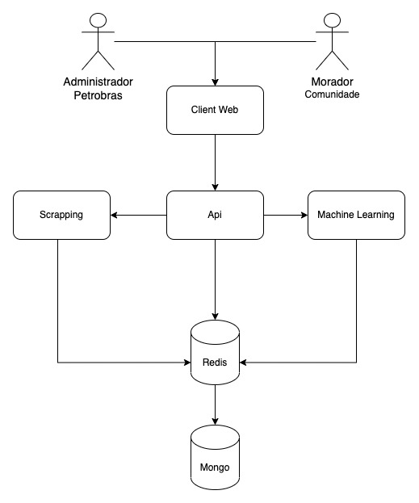

# RadarPetro
## Time 100 | ODS 11

Nosso time é formado por [Nathan Munis](https://github.com/santmunis), [Ruan Ferreira](https://github.com/droderuan), e eu [Ademario Santana](https://github.com/AdeLuigi)

---
## Apresentação 
Qual é o melhor jeito de saber o que uma comunidade precisa?! Escutando ela! O RadarPetro é uma plataforma web de cruzamento de dados obtidos por scrapping de publicações de moradores dessas comunidades nas redes sociais (twitter, facebook, instagram) e noticiais. Todos os dados são apurados por machine learning para ter uma melhor assertividade. Além disso os próprios moradores podem indicar temas que sejam relevantes e votar em temas que os interessam.

### Scrapping
Varremos a web a procura de publicações de moradores nas redes sociais e noticias que estão relacionadas as comunidades que estão no entorno das atividades da Petrobras. Com essa varredura, nós populamos um banco de dados MongoDB que será usado posteriormente para a análise e apuração desses dados.

### Dados primários
A plataforma também tem uma página em que os moradores podem sugerir temas importantes para a comunidade, esses temas serão votados pelos próprios moradores e os temas com maior pontuação ficarão em destaque. O morador também pode copiar o link do tema e compartilhar no Zap com a galera.

### Machine learning
O sistema pega todos os dados que foram passados anteriormente atráves de scrapping das redes socias/noticias e faz uma análise das demandas daquela população, gerando assim um dado macro informando os anseios da comunidade e dando uma base sólida de quais medidas a Petrobras deveria tomar nessa determinada região.

### Dados secundários
O site também informa sobre dados que foram coletados anteriormente em outras pesquisas, como o censo.

## Arquitetura do Projeto

### 

## Estrutura do projeto
    hacking-rio-2022
        --packages
            |--app
            |   |--package.json
            |
            |--api
            |   |--package.json
            |
            |--scrapping
                |--package.json
        --package.json
        --package-lock.json

## ❤️ Hacking Rio❤️

